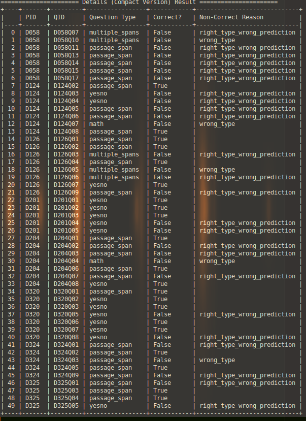
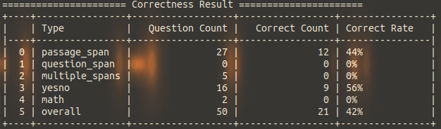
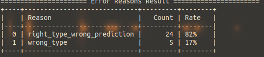

# Question Answering Evaluation Tools

The project targets on question answering models for 2020 Formosa Grand Challenge. It provides tools for correctness evaluation, analytics and visualization.

## Prerequisites

The project only support Python3. You need to install following packages via pip or conda:

- json-lines
- pandas
- tabulate

## Usages

### Example Usage

Run following command and you will see the results:

```bash
python3 eval.py \
  ./examples/official_1_questions.json \
  ./examples/official_1_answers.json \
  ./examples/predictions.jsonl
```

### Detailed Usages

Run following command to see detail usages:

```bash
python3 eval.py -h
```

The usages is shown as follows:

```
usage: eval.py [-h] [-o OUTPUT] questions_path answers_path predictions_path

Evaluation tool of question answering model for 2020 Formosa Grand Challenge

positional arguments:
  questions_path        Path to questions JSON file (.json)
  answers_path          Path to ground truth answers JSON file (.json)
  predictions_path      Path to predictions JSON Lines file (.jsonl)

optional arguments:
  -h, --help            show this help message and exit
  -o OUTPUT, --output OUTPUT
                        Path to directory that saves the results
```

## Outputs

After running the tools, you will get three kinds of result: [details](#details), [correctness](#correctness) and [error reasons](error-reasons).

### Details

The result shows detail for each of your model prediction. You can see a compact version report on stdout and full version report in `output/details.csv`.

Meaning of the fields:

- `PID`: Passage ID
- `QID`: Question ID
- `Passage`: Passage text (only in full version)
- `Question`: Question text (only in full version)
- `Question Type`: Question type, it can be:
    - `passage_span`: The answer should be extracted from passage
    - `question_span`: The answer should be extracted from question
    - `multiple_spans`: The answer should be extracted from passage (more than one span)
    - `yesno`: The answer should be yes or no
    - `math`: The answer is a math problem (arithmetic or counting)
- `Answer`: Ground truth text (only in full version)
- `Prediction`: Your model prediction text (only in full version)
- `Correct?`: Your model prediction is correct or not
- `Non-Correct Reason`: If your model prediction is not correct, what is the reason? It can be:
    - `right_type_wrong_prediction`: Your model predicted a correct question type, but its prediction is wrong
    - `wrong_type`: Your model predicted a wrong question type

An example of compact version details report is shown as follows:



### Correctness

The result shows correctness count and rate of each question type. You can see the report on stdout and in `output/correctness.csv`.

Meaning of the fields:

- `Type`: Question type, it can be:
- `Question Count`: Total count of that question type
    - `passage_span`: The answer should be extracted from passage
    - `question_span`: The answer should be extracted from question
    - `multiple_spans`: The answer should be extracted from passage (more than one span)
    - `yesno`: The answer should be yes or no
    - `overall`: All question types
    - `math`: The answer is a math problem (arithmetic or counting)
- `Correct Count`: Correct count of that question type from your predictions
- `Correct Rate`: Correct rate of that question type from your predictions

An example is shown as follows:



### Error Reasons

The result shows count and rate for each reason for non-correct predictions. You can see the report on stdout and in `output/error_reasons.csv`.

Meaning of the fields:

- `Reason`: The reason that your model predictions are not correct. It can be:
    - `right_type_wrong_prediction`: Your model predicted a correct question type, but its prediction is wrong
    - `wrong_type`: Your model predicted a wrong question type
- `Count`: Count of that reason from your non-correct predictions
- `Count`: Rate of that reason from your non-correct predictions

An example is shown as follows:


